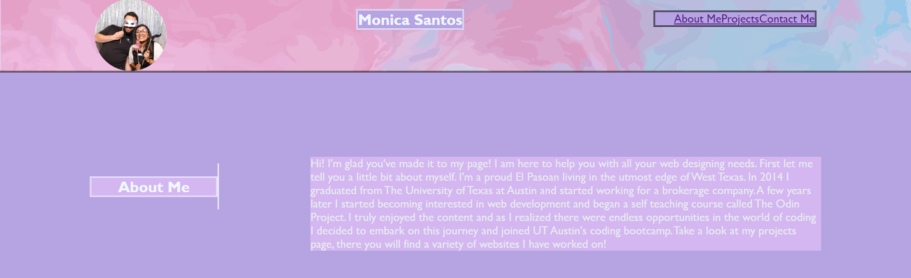
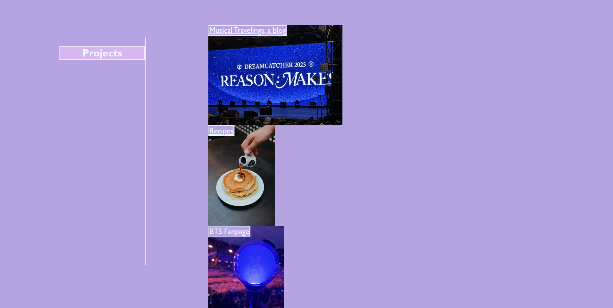

# Portfolio

## Description

This project was created to showcase the websites and other projects I have worked on to potential employers. 
It is also a home to these projects to aid in archiving all my works.

## Installation
No installation needed

## Usage
Navigate the website using the top navigation menu. Clicking on a specific navigation link will take you to that part of the website.
For example, clicking on the About Me link will take you to the About Me section.

Click on the underlined links of the Projects section to access that project.

Use the Contact Me links to reach out to me via email!

https://volcomix13.github.io/PortfolioMain/

Images of website:

## Credits
Code:
Tutor: Armando Osorio, assisted with main section layout
TA: Melissa Hookey, assisted with guidance on HTML and CSS layout options.

Pictures:

Background Photo by <a href="https://unsplash.com/@pawel_czerwinski?utm_source=unsplash&utm_medium=referral&utm_content=creditCopyText">Pawel Czerwinski</a> on <a href="https://unsplash.com/backgrounds/colors/gradient?utm_source=unsplash&utm_medium=referral&utm_content=creditCopyText">Unsplash</a>

Pancake Photo by <a href="https://unsplash.com/@nikldn?utm_source=unsplash&utm_medium=referral&utm_content=creditCopyText">nikldn</a> on <a href="https://unsplash.com/s/photos/pancakes?utm_source=unsplash&utm_medium=referral&utm_content=creditCopyText">Unsplash</a>
  

BTS lightstick and Dreamcatcher stage photos are my own.
  

## License
Please see lincese section in repository